 
# Distributed line justification in LibreOffice Writer
 

While working in LibreOffice Writer, I realize that I wanted a section with distributed line justification. This is where text aligns to both right and left margins, with blank space in between. It is like the converse of centered justification, where the text on a line is centered around the horizontal midpoint. Microsoft Word offers this, but by default, in Libre does not offer this option. 

## In MS Word
Here's what I mean in MS Word. Let's say we want a resumé with a heading section for contact information and other details, with some items left aligned and others right aligned on the same line. Let's start with the basic text like so. 

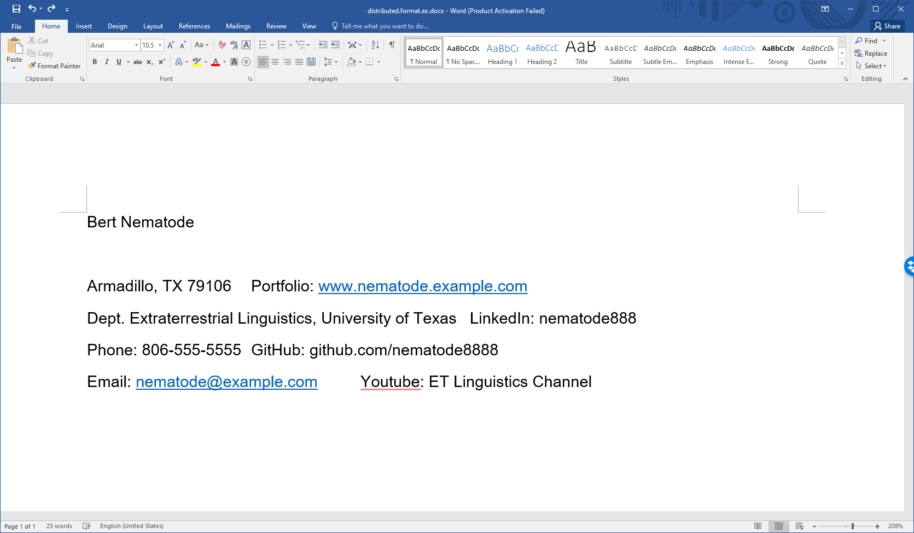

If we center it, it does not look readable or neat. 

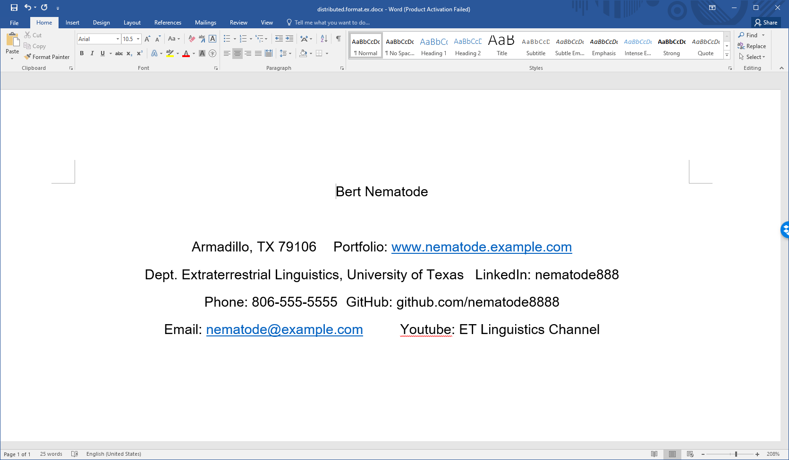

On the paragraph section of the ribbon, we see options for left, centered, and right justification, full justification, and then distributed justification, where text is distributed to both left and right margins. We can highlight the target text and activate distributed justification with that button, like so. 

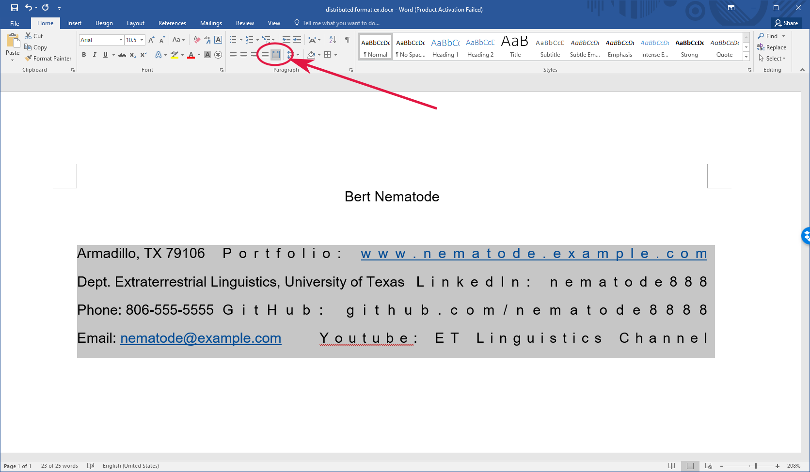

Then we add some tabs in between the text items on each line to make it prettier. We could add some extra tabs in the tab settings, or add some spacing, to push some of the text further right, and of course, change the font to something better looking. 

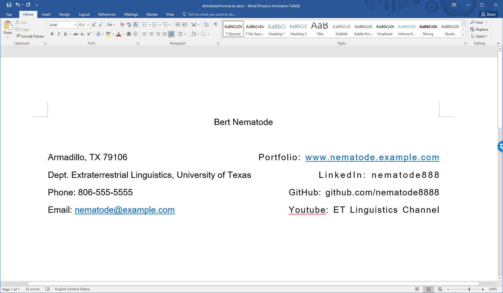

## How about Libre?
I found myself wanting to do this in LibreOffice Writer, but there was no such option.  

Now the great thing about Libre is that it offers a great deal of control over format settings. It allows you to easily edit the style settings for every format that is defined in a document, and the settings can be easily updated and applied to the whole document. It is far easier to manage the formatting in Libre than in Word. I looked in the alignment settings for formats in Libre, but there was no option for distributed justification. This  lack seemed like quite an oversight or omission for such a powerful tool as LibreOffice. But I really needed it for a document. 

But then I remembered that I've seen the effect done in Libre before. When it generates a table of contents, the TOC entries and page numbers are distributed, often with dotted lines filling the blank space, like so. 

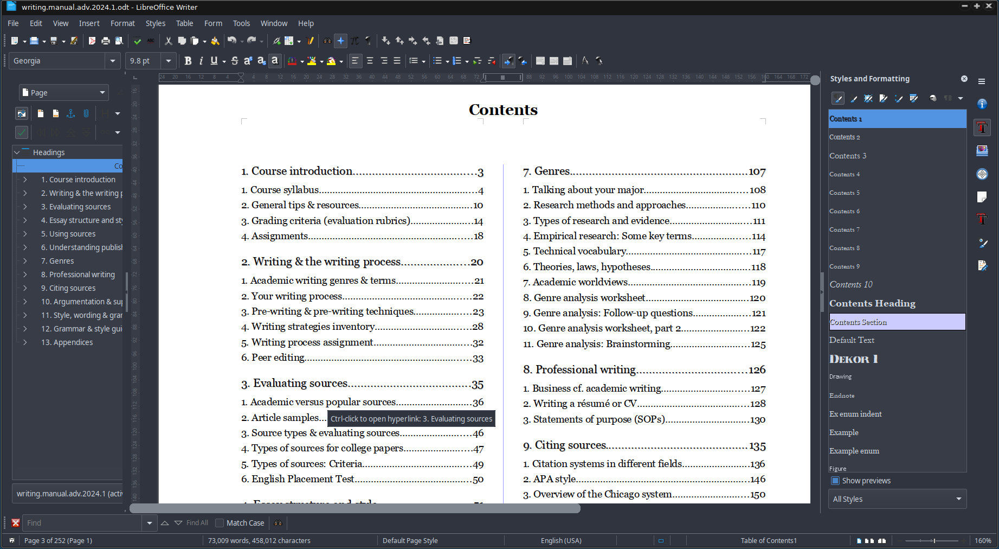

So I looked at the style options for TOC items (Contents 1, Contents 2, etc.), and found the workaround that Libre uses for TOC items. This can then be applied to other styles, as explained below. 

I will put the same text as before into a LibreOffice Writer document, apply the standard text body format to it. We go to the format bar, right click on the style settings for 'Text Body' and go to the Alignment tab. As you can see, the only options are for left, right, centered, and full justified. (If you don't see the Styles & Formatting menu on the right, you may need to click on the icon on the right, or in the menu bar, select View > Sidebar or View > Styles or something like that.)

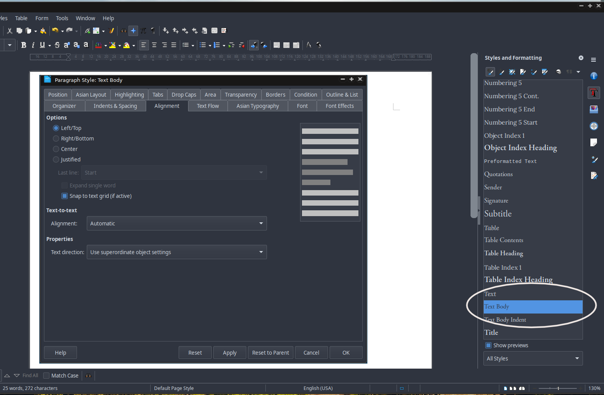

We'll close the dialogue box for the Text Body paragraph style. Now I'm going to create a new style by right clicking on Text Body (since I want to base the new style on the Text Body style), and create a new style, called Text Body distributed (or whatever you like). 

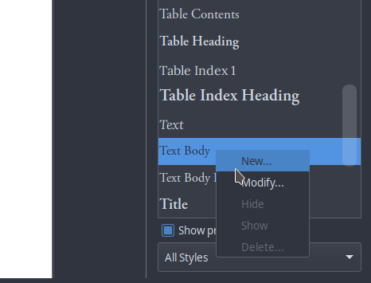

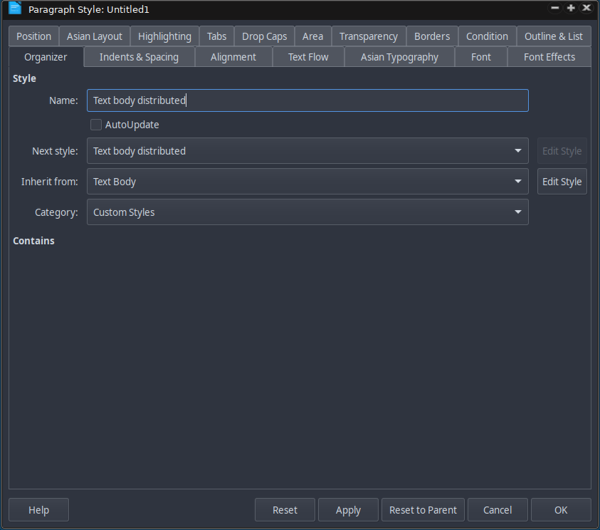

Now for the magic. We need to go to the tab for the paragraph style called Tabs, and set up the special tabbing that I found that Libre uses for its table of contents style. This is for the 'Text body distributed' paragraph style (as circled on the right side of the picture below, which is hard to see). If you look at the top left, you will see the horizontal grid bar. If this is turned off, then from the top menu, select View > Rulers > Rulers to turn it on. You can see the spacing at the very right margin, which I've circled in the upper right corner. In dark mode it may be hard to see, but in this document, the right margin is set at 176 mm. (Yours may be in pixels, centimeters, kilometers, or god forbid, inches.) 

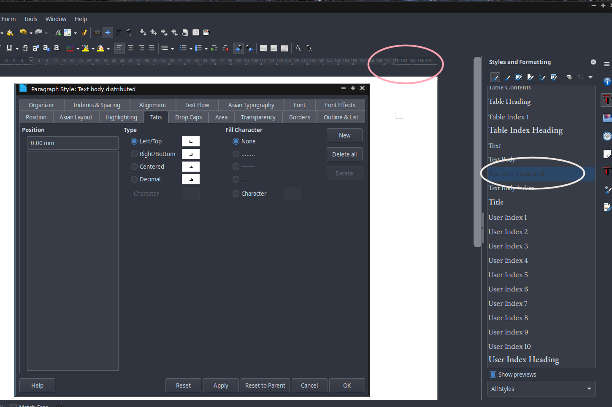

We will enter a new tab at 176 mm (or whatever the right margin is in your document), and make it right aligned. Click on 'New' on the right to enter it, and then OK to close the dialogue box. You can come back and tweak this if you need to. You could add fill characters if you like (I tried selecting Character and adding blank spaces, but that did nothing). You could change the right justification to centered. Instead of 176, you could place the tab just before the right margin, say, at 174 mm. 

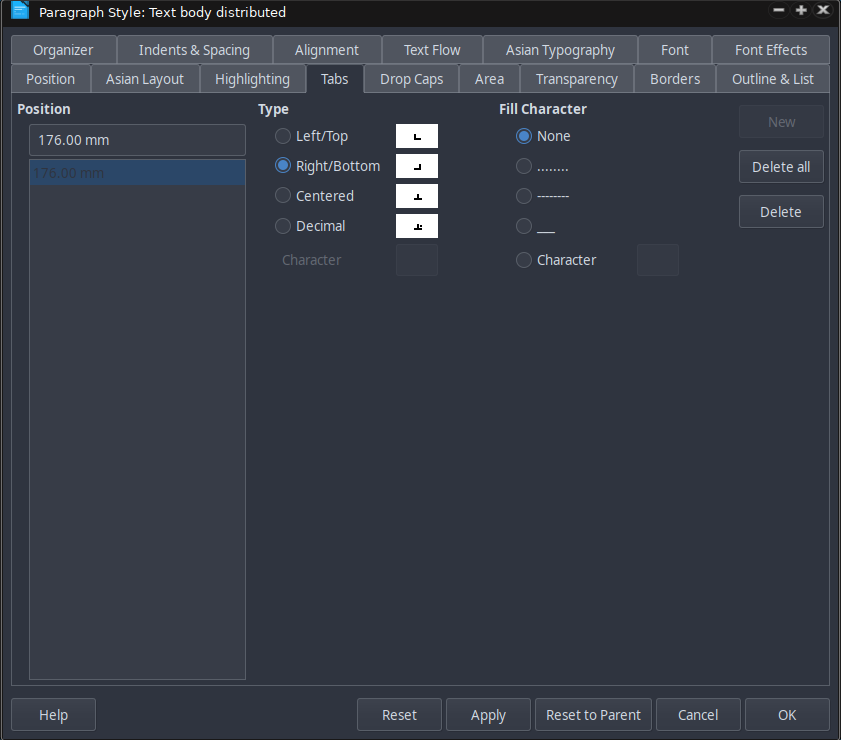

After closing the dialogue box, the text should be more or less properly distributed, like so. You may need to add in some spaces or tabbed spaces, and make other modifications to the paragraph style.  

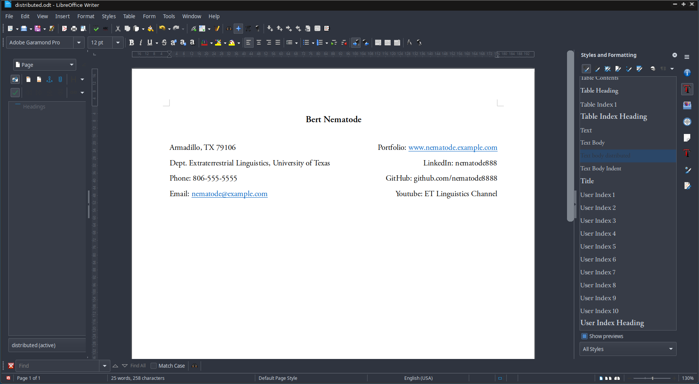

You can also go back to the style dialogue box, and add some extra left-aligned tabs around the center of the line. For example, if the first line is around 100 mm, you could add extra left tabs before the 100 mm mark to scoot the text over.  

## Or tables...
Incidentally, a simpler way might be to use a regular old table, make the borders invisible, put left aligned text in the left cell and right aligned text in the right cell. That may be easier, but there could be cases where that may not be a good idea. If you are uploading the LibreOffice file or a PDF created from it to some online system that reads files, the tables might confuse it, and text might get more garbled in the uploading and conversion process - like if you are uploading a resumé to an applicant tracking system for an online job application. 

## And managing URL appearance
By the way, if you want to make the URLs look nicer by default, you can edit the character format for that. If you look under 'Styles and Formatting' in the upper right above the paragraph styles menu, you will see several paintbrush icons. Click on the second one from the left for the character formats. At the bottom, select 'All styles' to display all the styles. You will see the Internet Link or Visited Internet Link style that corresponds to the style of the URLs. You can edit the formatting for that, or create and apply a new one. In the dialogue box, go to Font Effects and turn off the annoying underlining. If you like, you can apply a different font or font size, or under Position, you can alter the spacing to make it more compact. Click okay, highlight the URLs if necessary, and double click on the character style to apply it. You may also need to select the URL, and right click (or Control-M) to remove other formatting features. 

Anyway, that is my workaround for distributed line justification in LibreOffice Writer. Hope this helps. 

